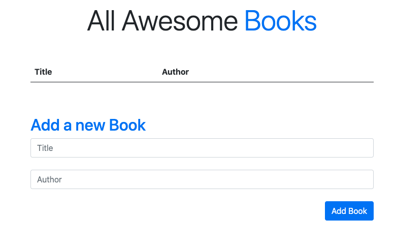

# Awesome Books

> In this project, we built a basic website that allows users to add/remove books from a list. we achieved that by using JavaScript objects,classes and arrays. We also performed dynamically modification to the DOM and add basic events.

# Live Screenshot 

## Built With

- HTML
- CSS
- Javascript
- Bootstrap
- Linters (ESlint, Stylelint, WebHint)

## Live Demo

[Live Demo Link](https://dansam5k.github.io/Awesome-Books/)

## Authors

👤 **Zain Sadaqat**

- GitHub: [@githubhandle](https://github.com/githubhandle)
- Twitter: [@twitterhandle](https://twitter.com/twitterhandle)
- LinkedIn: [LinkedIn](https://linkedin.com/in/linkedinhandle)

👤 **Daniel Samuel**

- Github: [DanSam5k](https://github.com/DanSam5k)
- Twitter: [@_dan_sam](https://twitter.com/_dan_sam)
- Linkedin: [dansamuel](https://www.linkedin.com/in/dansamuel/)

👤 **KARANGWA Ntwali Josue**

- GitHub: [@githubhandle](https://github.com/Ntwali-Josue)
- Twitter: [@twitterhandle](https://twitter.com/JosueNtwali)
- LinkedIn: [LinkedIn](https://linkedin.com/in/karangwa)

## 🤝 Contributing

Contributions, issues, and feature requests are welcome!

Feel free to check the [issues page](https://github.com/DanSam5K/Awesome-Books/issues).

## Show your support

Give a ⭐️ if you like this project!

## Acknowledgments

- Hat tip to anyone whose code was used
- Inspiration
- etc

## 📝 License

This project is [MIT](https://docs.github.com/en/github/creating-cloning-and-archiving-repositories/licensing-a-repository) licensed.
